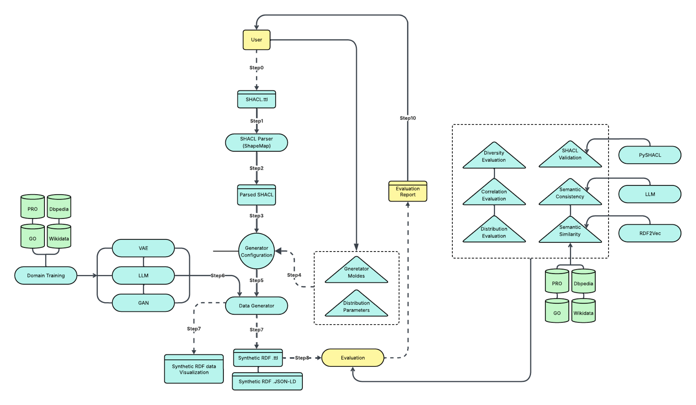

# SRDF-GEN: SHACL-based Synthetic Knowledge Graph Generator (SHACL-KGSDG-App)

SRDF-GEN is a web-based framework for schema-driven RDF data generation guided by SHACL shapes and ontology structures. It provides a flexible, modular, and reproducible environment for generating synthetic Knowledge Graph (KG) data, enabling benchmarking, privacy-preserving research, and experimentation in the Semantic Web domain.

Paper Dataset: Example SHACL schemas and generated synthetic data are available at [Zenodo (DOI: 10.5281/zenodo.17497899)](https://zenodo.org/records/17497899)

---

## Table of Contents

1. Overview
2. Architecture
3. Features
4. Requirements and Prerequisites
5. Environment Variables
6. Local Deployment (Docker Compose)
7. Using the Application
8. Demo Video
9. Deployment on Cloud Platforms
10. Development Notes
11. Citing SRDF-GEN
12. License

---

## Overview

Access to real-world data is often limited by privacy restrictions, data scarcity, and biases. In fields such as healthcare, finance, and scientific research, access is further constrained by ethical and regulatory factors.

SRDF-GEN addresses these challenges by providing a Synthetic RDF Data Generation framework that:
- Utilizes SHACL shapes to drive RDF schema-aware data generation.
- Integrates generative backends for realistic and varied data synthesis.
- Ensures structural validity and semantic consistency with ontologies.

The system enables the generation, evaluation, and export of RDF data for reproducible Semantic Web research.

---

## Architecture

Core Components:
- FastAPI Backend: manages SHACL parsing, RDF generation logic, and data persistence.
- Streamlit Frontend: offers an interactive web UI for uploading SHACL files, configuring parameters, and visualizing results.
- MongoDB Database: stores generation configurations, logs, and synthetic data records.



---

## Features

- SHACL2Shape Parser: Automatically converts SHACL schemas into generator-ready shape structures.
- Subject–Predicate–Object Tokenization: Enables compatibility with LLM and generative models.
- Pluggable Generative Backends: Extensible integration for LLMs or statistical models.
- Statistical Distribution Module: Allows fine-grained control over data distributions.
- RDF & JSON-LD Output: Supports multiple export formats.
- Web Interface: Simple UI for non-technical users to generate and inspect RDF graphs.
- MongoDB Integration: Persistent, queryable storage of generated datasets.

---

## Requirements and Prerequisites

| Tool | Version | Description |
|------|---------|-------------|
| Docker | >= 20.10 | Containerization engine |
| Docker Compose | >= 1.29 | Multi-container orchestration |
| Git | Latest | Clone and manage repository |
| Python | 3.9+ | Optional, for local development |

---

## Environment Variables

Create a `.env` file in the root directory:

```
# GROQ API Configuration
GROQ_BASE_URL=https://api.groq.com/v1
GROQ_API_KEY=your_api_key_here

# MongoDB Connection
MONGO_URI=mongodb://host.docker.internal:27017/?directConnection=true
```

These are automatically loaded by `config.py` using `python-dotenv`.

---

## Local Deployment (Docker Compose)

### Clone the repository

```
git clone https://github.com/RadmehrA/SHACL-KGSDG-App.git
cd SHACL-KGSDG-App
```

### Create `.env` file

Use the template above.

### Build and start the services

```
docker-compose up --build
```

This will:
- Build the backend (FastAPI) and frontend (Streamlit) images.
- Pull the MongoDB image.
- Create a shared Docker network (`app_network`).
- Mount local volumes for saved models and uploaded files.

### Access the running services

| Service | URL | Description |
|---------|-----|-------------|
| Streamlit Frontend | http://localhost:8501 | Web interface |
| FastAPI Backend | http://localhost:8000/docs | Interactive API documentation |
| MongoDB | localhost:27017 | Local database instance |

---

## Using the Application

1. Upload SHACL Schema: Use the frontend to upload SHACL shape files or select sample ones.
2. Configure Generation Parameters: Choose target triple count, property constraints, and generation mode.
3. Run Synthetic KG Generation: The backend generates RDF data conforming to SHACL constraints.
4. Export Data: Download results as `.ttl`, `.jsonld`, or `.nt` formats.
5. Inspect or Reuse Results: View generated KGs via the Streamlit interface or connect to MongoDB for programmatic access.

---

## Demo Video

See SRDF-GEN in action. This demo walks through uploading SHACL schemas, generating synthetic KGs, and exporting the results.

<video width="600" controls>
  <source src="demo.mp4" type="video/mp4">
  Your browser does not support the video tag.
</video>

---

## Deployment on Cloud Platforms

Docker Hub:

```
docker build -t yourusername/srdf-gen:latest .
docker push yourusername/srdf-gen:latest
```

Render / Railway / Heroku (Container Deployment):
- Create a new Web Service from your GitHub repo.
- Use `docker-compose.yml` as the build file.
- Set environment variables from your `.env`.
- Expose ports 8000 (Backend) and 8501 (Frontend).

AWS ECS / Fargate:
- Push the built image to Amazon ECR.
- Define ECS task definitions for `fastapi-backend`, `streamlit-frontend`, and `mongo`.
- Expose ports 8000, 8501, 27017.

---

## Development Notes

Rebuild containers after code changes:
```
docker-compose up --build
```

Stop containers:
```
docker-compose down
```

Clean everything (including database):
```
docker-compose down -v
```

---

## Citing SRDF-GEN

If you use SRDF-GEN in your research or projects, please cite:

Radmehr A., et al. (2025). SRDF-GEN: SHACL-based Synthetic Knowledge Graph Generator. A SHACL-guided framework for RDF synthetic data generation and benchmarking. [Zenodo Record 17497899](https://zenodo.org/records/17497899)

---

## License

This project is released under the MIT License. You are free to use, modify, and distribute it for research and commercial purposes.

