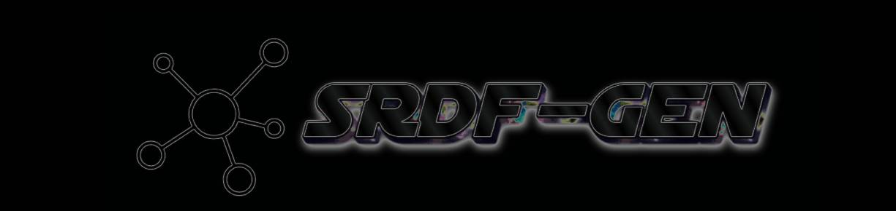

# Synthetic RDF Data Generator (SRDF-GEN)

SRDF-GEN is a web-based framework for schema-driven RDF data generation guided by SHACL shapes and ontology structures. The system supports three generative models—LLM, GAN, and VAE—to produce high-quality RDF triples based on user-defined shapes and distributions.

Paper Dataset and Example SHACL: [Zenodo Record](https://zenodo.org/records/17497899)

## Key Features

- Upload SHACL `.ttl` files to define your data schema
- Tree-based visualization of target classes and properties
- Per-property selection of:
  - Generative model: LLM, GAN, or VAE
  - Data distribution
  - Number of samples to generate
- Download generated data in:
  - `.ttl` (Turtle)
  - `.json`
  - `.json-ld`
- Uses pretrained GAN/VAE models trained on [DBpedia Core Triples](https://databus.dbpedia.org/dbpedia/collections/latest-core)
- No training data required from the user
- Easily extensible to support other knowledge bases like Wikidata

## Technologies Used

- FastAPI – Backend API
- Streamlit – Web UI for interactive input and output
- PyTorch / TensorFlow – For VAE and GAN model inference
- SPARQLWrapper, rdflib, PySHACL – For RDF manipulation and validation
- Docker – Containerized deployment
- SHACL – Schema constraint definitions
- GPT API – Used by the LLM model for generating RDF triples

## Architecture

Core Components:
- FastAPI Backend: manages SHACL parsing, RDF generation logic, and data persistence.
- Streamlit Frontend: offers an interactive web UI for uploading SHACL files, configuring parameters, and visualizing results.
- MongoDB Database: stores generation configurations, logs, and synthetic data records.


## How to Deploy

You can deploy the app locally using Docker Compose, which will spin up:

- FastAPI backend
- Streamlit frontend
- MongoDB database

### Prerequisites

- Docker
- Docker Compose
- Visual Studio Code (recommended)

> MongoDB and Docker must be running before building the project.

### Steps

```bash
# Clone the repository
git clone https://github.com/RadmehrA/SHACL-KGSDG-App.git
cd SHACL-KGSDG-App

# Start MongoDB and all services via Docker
docker-compose up --build
```

This will:
- Build FastAPI and Streamlit services
- Mount `./models/saved_models` and `./uploaded` into backend container
- Set up MongoDB with local volume `mongo-data`

**Access the App**

- Backend (FastAPI): [http://localhost:8000/docs](http://localhost:8000/docs)
- Frontend (Streamlit): [http://localhost:8501/docs](http://localhost:8501/docs)

### Using Visual Studio Code

- Open and edit the codebase easily
- Launch Docker containers using the Docker extension (optional)

## How to Use the App

1. Open the Streamlit frontend at [http://localhost:8501/docs](http://localhost:8501/docs).
2. Upload your SHACL `.ttl` file in the Settings section.
3. View the tree-based representation of target classes and properties.
4. Configure property settings: choose model (LLM/GAN/VAE), data distribution, and number of samples.
5. Click **Generate synthetic data (batch request)** to generate RDF triples.
6. Preview the generated data.
7. Use the interactive chat box for LLM model refinement.
8. Download the generated data in `.json`, `.json-ld`, or `.ttl` formats.

## How to Use the Models

### LLM (Large Language Model)

- Provide an API key from a GPT provider (e.g., Groq Console).
- Input the API key in the `.env` file.
- Premium accounts unlock unlimited data generation; free tier has sample limits.

### GAN and VAE Models

- Pretrained models are available in the repository.
- To extend or train new models:
  - Access backend APIs at `/upload_and_train_gan/` or `/upload_and_train_vae/`
  - Upload domain-specific `.ttl` files from DBpedia or Wikidata
  - Set training parameters and execute to store models
- Restart Docker containers to automatically load trained models.

## Demo Video

<video width="600" controls>
  <source src="demo.mp4" type="video/mp4">
  Your browser does not support the video tag.
</video>

## Citing SRDF-GEN

Radmehr A., et al. (2025). SRDF-GEN: SHACL-based Synthetic Knowledge Graph Generator. A SHACL-guided framework for RDF synthetic data generation and benchmarking. [Zenodo Record 17497899](https://zenodo.org/records/17497899)

## License

MIT License. You are free to use, modify, and distribute for research and commercial purposes.

